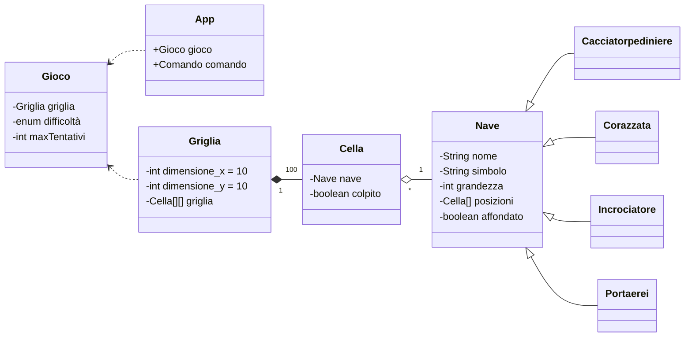

 # Indice
  

## 1. Introduzione 

<p>Questo programma è una simulazione del gioco da tavolo Battaglia Navale. All'inizio del gioco, il sistema posizionerà le proprie navi in modo segreto e randomico sulla propria griglia di gioco. 

La griglia avrà un formato del genere:


Le navi possono essere posizionate orizzontalmente o verticalmente e non possono sovrapporsi o toccarsi.

Lo scopo del gioco è affondare tutte le navi posizionate dal sistema. In ogni turno, il giocatore sceglie una casella sulla griglia in cui colpire, cercando di colpire le navi nemiche.

Se la casella colpita contiene una nave, il sistema segnerà la casella come "colpita", altrimenti verrà segnata come "mancata".


Il gioco proseguirà fino a quando il giocatore ha terminato i tentativi o tutte le navi sono state affondate.

E' possibile scegliere il livello di difficoltà del gioco, che determinerà il numero di tentativi a disposizione del giocatore.

## 2. Modello di dominio 



## 3. Requisiti Specifici
<p>In questa sezione sono presenti i requisiti funzionali e non funzionali che sono emersi durante un'analisi dei requisiti che è avvenuta confrontando il Product Owner. </p>

 
### 3.1 Requisiti Funzionali

 

 - **RF1**: Come giocatore voglio mostrare l'help con elenco comandi</br>
    **Attore**: User</br>
    **Criteri di accettazione**: Al comando **/help** o invocando l'app con flag **--help** o **-h**
     il sistema riponde con una descrizione coincisa, seguita dalla lista di comandi disponibili, uno per riga, come da esempio successivo:</br>
   •  gioca</br>
   •  esci</br>
   •  ...
   
- **RF2**: Come giocatore voglio chiudere il gioco</br>
   **Attore**: User</br>
    **Criteri di accettazione**:</br>
   Al comando **/esci**
il sistema chiede conferma:</br>
•  se la conferma è positiva, l'applicazione si chiude restituendo il controllo al sistema operativo</br>
•  se la conferma è negativa, l'applicazione si predispone a ricevere nuovi tentativi o comandi</br>

- **RF3**: Come giocatore voglio impostare il livello di gioco per variare il numero massimo di tentativi sbagliati</br>
   **Attore**: User</br>
    **Criteri di accettazione**:</br>
   • Al comando **/facile** </br>
         il sistema conferma e imposta a 50 il numero massimo di tentativi falliti</br>
• Al comando **/medio** </br>
il sistema conferma  e imposta a 30 il numero massimo di tentativi falliti</br>
• Al comando **/difficile** </br>
il sistema conferma e imposta a 10 il numero massimo di tentativi falliti</br>

- **RF4**: Come giocatore voglio mostrare il livello di gioco e il numero di massimo di tentativi falliti</br>
   **Attore**: User</br>
    **Criteri di accettazione**: Al comando **/mostralivello**
il sistema risponde visualizzando il livello di gioco e il numero di massimo di tentativi falliti

- **RF5**: Come giocatore voglio mostrare i tipi di nave e il numero </br>
   **Attore**: User</br>
    **Criteri di accettazione**: Al comando **/mostranavi** </br>
il sistema risponde visualizzando, per ogni tipo di nave, la dimensione in quadrati e il numero di esemplari da affondare:</br></br>
•  Cacciatorpediniere   ⊠⊠      esemplari: 4</br>
•  Incrociatore         ⊠⊠⊠     esemplari: 3 </br>
•  Corazzata            ⊠⊠⊠⊠    esemplari: 2 </br>
•  Portaerei            ⊠⊠⊠⊠⊠  esemplari: 1 

- **RF6**: Come giocatore voglio iniziare una nuova partita </br>
   **Attore**: User</br>
    **Criteri di accettazione**: Al comando **/gioca** 
se nessuna partita è in corso, il sistema imposta causalmente le navi nella griglia, in orizzontale o in verticale, mostra la griglia vuota e si predispone a ricevere il primo tentativo o altri comandi.  

- **RF7**: Come giocatore voglio svelare la griglia con le navi posizionate <br>
   **Attore**: User</br>
    **Criteri di accettazione**: Al comando **/svelagriglia** 
il sistema risponde visualizzando, una griglia 10x10, con le righe numerate da 1 a 10 e le colonne numerate da A a J, e tutte le navi posizionate  

### 3.2 Requisiti Non Funzionali

- **RNF1**: il container docker dell’app deve essere eseguito da terminali che supportano Unicode con encoding UTF-8 o UTF-16.
Elenco di terminali supportati:</br>
   - Linux: </br>
      • terminal</br>
   - Windows: </br>
      • Powershell</br>
      • Git Bash (in questo caso il comando Docker ha come prefisso winpty; es: winpty docker -it ....)</br></br>

   Comando per l’esecuzione del container: </br>
   Dopo aver eseguito il comando docker pull copiandolo da GitHub Packages, Il comando Docker da usare per eseguire il container contenente l’applicazione è:</br>
   ```bash
   $ docker run --rm -it ghcr.io/softeng2223-inf-uniba/battleship-base2223:latest
   ```
   dove base2223 sarà sostitituito con il nome del gruppo.


## 4. System Design

  ### 4.1 Stile architetturale adottato (opzionale)

  ### 4.2 Diagramma dei package, diagramma dei componenti (opzionali) 

  ### 4.3 Commentare le decisioni prese (opzionale)

## 5. OO Design  

  ### 5.1 Diagrammi delle classi e diagrammi di sequenza 

  ### 5.2 Per le user story considerate più importanti 

  ### 5.3 Menzionare l'eventuale applicazione di design pattern (opzionale)  

  ### 5.4 Commentare le decisioni prese (opzionale)

## 6. Riepilogo del test 

   ### 6.1 Riportare la tabella riassuntiva di coveralls (o jacoco), con dati sul numero dei casi di test e copertura del codice

## 7. Manuale utente


### 7.1 Come avviare una nuova partita

Per avviare una nuova partita è necessario digitare il comando **/gioca**. 
Se nessuna partita è in corso, il sistema imposta casualmente le navi nella griglia, in orizzontale o in verticale, 
mostra la griglia vuota e si predispone a ricevere il primo tentativo o altri comandi.

### 7.2 Come mostrare l'elenco dei comandi

Per mostrare l'elenco dei comandi è necessario digitare il comando **/help**.
Verrà mostrato l'elenco dei comandi disponibili.

### 7.3 Come impostare il livello di gioco

Per impostare il livello di gioco è necessario digitare il comando **/facile**, **/medio** o **/difficile**.
A seconda del comando digitato, il sistema conferma e imposta a 50, 30 o 10 il numero massimo di tentativi falliti.

### 7.4 Come mostrare il livello di gioco

Per mostrare il livello di gioco è necessario digitare il comando **/mostralivello**. Verrà mostrato il livello di gioco
e il numero di massimo di tentativi falliti.

### 7.5 Come mostrare i tipi di nave e la quantità

Per mostrare i tipi di nave e la quantità è necessario digitare il comando **/mostranavi**. 
Verrà mostrato, per ogni tipo di nave, la dimensione in quadrati e il numero di esemplari da affondare:

### 7.6 Come svelare la griglia con le navi posizionate

Per svelare la griglia con le navi posizionate è necessario digitare il comando **/svelagriglia**. 
Verrà mostrata una griglia 10x10, con le righe numerate da 1 a 10 e le colonne numerate da A a J, e tutte le navi posizionate.

### 7.7 Come chiudere il software

Per chiudere il software è necessario digitare il comando **/esci**. Verrà mostrato un messaggio di conferma e il software verrà chiuso.

## 8. Processo di sviluppo e organizzazione del lavoro

## 9. Analisi retrospettiva 

### 9.1 Sprint 0 – screenshot di una lavagna a partire dal modello Retrospettiva/"Arrabbiato, triste, felice" (Mad, Sad, Glad)


