# Avventura testuale "Escape From Lab"

## Descrizione del caso di studio:

Il caso di studio consiste in un'applicazione Java che simula un'avventura testuale all'interno di un misterioso laboratorio. L'obiettivo del giocatore è quello di scappare dal laboratorio risolvendo enigmi, collezionando oggetti utili e interagendo con l'ambiente circostante.

L'implementazione del gioco fa uso della libreria Swing per la creazione di una grafica semplice ma coinvolgente. L'interfaccia utente è realizzata attraverso una finestra principale creata con la classe JFrame, che ospita i componenti grafici necessari per la visualizzazione delle immagini e l'interazione con il gioco.

Le immagini utilizzate per rappresentare il laboratorio e i suoi elementi sono caricate utilizzando la classe ImageIcon di Swing. Queste immagini vengono visualizzate all'interno del Panel di background (JPanel) posizionata all'interno della finestra principale. Attraverso la combinazione di immagini e testo, il giocatore può esplorare il laboratorio e prendere decisioni che influenzeranno lo sviluppo del gioco.

L'interazione dell'utente avviene tramite l'utilizzo di una textField per inserire comandi. L'utente può digitare comandi come "NORD", "OSSERVA" o "PRENDI OGGETTO" nella textField. Per confermare l'input, viene utilizzato la pressione del tasto "Invio" sulla textField.

L'output del gioco viene visualizzato in una textArea. Dopo aver inviato un comando, il gioco elabora l'input e genera una risposta che viene quindi visualizzata nella textArea. L'utente può leggere il feedback del gioco, come descrizioni delle stanze o informazioni sugli oggetti all'interno della textArea.

In questo modo, l'utente può comunicare con il gioco attraverso i comandi scritti nella textField e ricevere il feedback del gioco visualizzato nella textArea.

La logica del gioco è gestita principalmente dalla classe EscapeFromLabGame, che rappresenta il cuore del gioco di fuga dal laboratorio. Questa classe viene lanciata dalla classe Engine, che funge da intermediario tra EscapeFromLabGame e l'interfaccia grafica.

All'interno della classe EscapeFromLabGame, viene gestito il flusso del gioco, inclusi gli eventi di input dell'utente, il controllo delle azioni disponibili e l'aggiornamento dello stato del gioco. Ad esempio, la classe può contenere metodi per gestire il movimento del giocatore, l'interazione con gli oggetti, la comunicazione con i personaggi non giocanti e la risoluzione degli enigmi.

La classe Engine si occupa di inizializzare e gestire l'interfaccia grafica, nonché di gestire gli eventi di input dell'utente provenienti dalla GUI e di passarli alla classe EscapeFromLabGame per l'elaborazione. L'output generato dalla logica del gioco viene quindi restituito dalla classe EscapeFromLabGame all'interfaccia grafica attraverso la classe Engine, che si occupa di visualizzare l'output appropriato agli utenti.

In questo modo, la classe Engine svolge un ruolo di intermediario tra la logica di gioco rappresentata dalla classe EscapeFromLabGame e l'interfaccia grafica, consentendo una gestione efficiente delle interazioni tra il gioco e l'utente.

L'input dell'utente viene elaborato tramite un parser. All'interno della classe Engine, viene utilizzato un parser per analizzare e interpretare i comandi inseriti dall'utente. Il parser è responsabile di analizzare la sintassi dei comandi e di estrarre le informazioni rilevanti per il gioco.

Una volta che il parser ha estratto le informazioni necessarie dal comando dell'utente, queste informazioni vengono utilizzate per attivare le funzioni appropriate nella classe EscapeFromLabGame. Ad esempio, se l'utente digita il comando "NORD", il parser può estrarre l'informazione che l'utente desidera muoversi verso nord e passare questa informazione alla classe EscapeFromLabGame per gestire l'azione di movimento nella direzione desiderata.

In questo modo, il parser svolge un ruolo fondamentale nel consentire al gioco di interpretare e rispondere ai comandi dell'utente in modo appropriato.

## Diagramma delle classi

```mermaid
classDiagram
namespace db{
class DBManager {
- conn: Connection
+ DBManager()
+ initTables()
+ getGameStatus(username: String): GameStatus
+ insertNewGameStatus(gamestatus: GameStatus): int
+ getAllSavedGame(): List<GameStatus>
}

    class GameStatus {
        - username: String
        - lastRoomId: Integer
        - inventory: List[Integer]
        - time: LocalDateTime
        + GameStatus(username: String, lastRoomId: Integer, inventory: List<Integer>, time: LocalDateTime)
        // Aggiungi i metodi getter per gli attributi
    }
    }

    
    class EscapeFromLabGame {
        + EscapeFromLabGame()
        - initCommands(): void
        - initRooms(): void
        - goNorth(isKeyNeeded: MutableBoolean): boolean
        - goSouth(isKeyNeeded: MutableBoolean): boolean
        - goEast(isKeyNeeded: MutableBoolean): boolean
        - goWest(isKeyNeeded: MutableBoolean): boolean
        - checkInventory(): String
        - checkRoom(): String
        - pickUpObject(p: ParserOutput): String
        - openObject(p: ParserOutput): String
        - useObject(p: ParserOutput): String
        - unlockObject(p: ParserOutput): String
        - turnOnObject(p: ParserOutput): String
        - turnOffObject(p: ParserOutput): String
        - canAccessRoom(room: Room): boolean
        - nextMove(p: ParserOutput): String
    }
    
    class AdvObject {
        - id: int
        - name: String
        - description: String
        - alias: Set&lt;String&gt;
        - openable: boolean = false
        - pickupable: boolean = true
        - pushable: boolean = false
        - open: boolean = false
        - push: boolean = false
        - usable: boolean = false
        - switchable: boolean = false
        - lockable: boolean = false
        - password: String = null
        + AdvObject(id: int, name: String)
        + AdvObject(id: int, name: String, description: String)
        + AdvObject(id: int, name: String, description: String, alias: String[])
        // getters and setters
    }

    class AdvObjectContainer {
        // Attributi e metodi di AdvObjectContainer
    }

    class Command {
        // Attributi e metodi di Command
    }

    class CommandGUIOutput {
        // Attributi e metodi di CommandGUIOutput
    }

    class CommandGUIType {
        // Attributi e metodi di CommandGUIType
    }

    class CommandType {
        // Attributi e metodi di CommandType
    }

    class Room {
        - powered: boolean = false
        - id: int
        - name: String
        - description: String
        - look: String
        - visible: boolean = true
        - south: Room = null
        - north: Room = null
        - east: Room = null
        - west: Room = null
        - backgroundImage: Image
        - backgroundEnlightedImage: Image
        - accessible: boolean = true
        - key: AdvObject = null
        - isVisited: boolean = false
        - isDark: boolean = false
        - objects: List&lt;AdvObject&gt;
        + Room(id: int, name: String, description: String)
        + Room(id: int, name: String, description: String, accessible: boolean, key: AdvObject)
        
    }

    class TimerListener {
        - isRunning: volatile boolean = true
        - progress: int = 0
        - gui: AdventureGameGUI
        - delay: int
        + TimerListener()
        + run(): void
        + stopTimer(): void
    }

    class Engine {
        - game: GameDescription
        - parser: Parser
        - gui: AdventureGameGUI
        - dbManager: DBManager
        - timer: TimerListener
        
        + Engine(game: GameDescription)
        + loadGame(username: String): void
        + saveGame(username: String): void
        + execute(): CommandGUIOutput
        + executeCommand(command: String): CommandGUIOutput
    }

    class GameDescription {
        <<Abstract>>
        - rooms: List[Room]
        - commands: List[Command]
        - inventory: List[AdvObject]
        - objectsInGame: List[AdvObject]
        - currentRoom: Room 
        - timer: TimerListener 
        + getRooms(): List&lt;Room&gt;
        + filterRoom(predicate: Predicate&lt;Room&gt;): List&lt;Room&gt;
        + getCommands(): List&lt;Command&gt;
        + getCurrentRoom(): Room
        + setCurrentRoom(currentRoom: Room): void
        + setInventory(list_obj: List&lt;AdvObject&gt;): void
        + setTimer(timer: TimerListener): void
        + getTimer(): TimerListener
        + getListObjects(): List&lt;AdvObject&gt;
        + filterObjects(predicate: Predicate&lt;AdvObject&gt;): List&lt;AdvObject&gt;
        + getInventory(): List&lt;AdvObject&gt;
        + init(): void
        + nextMove(p: ParserOutput): String
    }

    class Utils {
        // Attributi e metodi di Utils
    }

    class Thread {
        // Attributi e metodi di Thread
    }

     class SavedGame {
        + SavedGame(savedGames: List&lt;GameStatus&gt;, engine: Engine, mainPanel: JPanel, contentPanel: JPanel)
    }

    class Parser {
        - stopwords: Set&lt;String&gt;
        + Parser(stopwords: Set&lt;String&gt;)
        + checkForCommand(token: String, commands: List&lt;Command&gt;): int
        + checkForObject(token: String, objects: List&lt;AdvObject&gt;): int
        + checkForAuxText(tokens: List&lt;String&gt;): String
        + parse(command: String, commands: List&lt;Command&gt;), objects: List&lt;AdvObject&gt;), inventory: List&lt;AdvObject&gt;)): ParserOutput
    }

    class Printer {
        - textArea: JTextArea
        - delay: int
        + Printer(textArea: JTextArea, delay: int)
        + printText(inputText: String): void
    }

    class AdventureGameGUI {
        - mainPanel: JPanel = null
        - startPanel: JPanel = null
        - textArea: JTextArea = null
        - scrollPane: JScrollPane = null
        - textField: JTextField = null
        - sidePanel: JPanel = null
        - contentPanel: JPanel = null
        - backgroundPanel: JPanel = null
        - backgroundImage: Image = null
        - engine: Engine
        - shouldCloseGame: boolean = false
        - progressBar: JProgressBar
        - backgroundTimer: TimerListener
        - printer: Printer
        - isDead: boolean
        + AdventureGameGUI(engine: Engine)
        + performCommand(command: CommandGUIOutput): void
        + appendAreaText(text: String): void
        + printHelp(): String
        + startGame(): void
        + startLoadedGame(id: int): void
        + loadGame(): void
        + showSavedGames(): void
        + die(string: String): void
    }

    GameDescription <|-- EscapeFromLabGame
    TimerListener <|-- Thread
    AdventureGameGUI <|-- JFrame
    TimerListener ..> AdventureGameGUI
    GameDescription o-- Room
    GameDescription o-- AdvObject
    GameDescription o-- TimerListener
    Engine o-- AdventureGameGUI
    Engine o-- DBManager
    Engine o-- Parser
    Engine o-- GameDescription
    Engine o-- TimerListener
    Room o-- Room
    Room o-- AdvObject
    AdventureGameGUI *-- SavedGame : classe interna
    AdventureGameGUI *-- Printer : classe interna
direction RL
```

## Manuale Utente

### Introduzione
Ti trovi all'interno di un laboratorio scientifico avanzato, ma purtroppo, una catastrofe è imminente. 
Il laboratorio è stato avvolto da nubi radioattive che si stanno espandendo rapidamente. 
Il tuo obiettivo principale è quello di trovare un modo per uscire dal laboratorio il prima possibile e metterti in salvo.

### Istruzioni di Gioco

Il gioco utilizza un sistema di riferimento relativo per la navigazione. 
L'ambiente è suddiviso in stanze, ognuna delle quali è collegata ad altre stanze in base alla posizione cardinale. 
Ad esempio, se ti sposti ad ovest da una stanza, per tornare indietro dovrai utilizzare il comando "sud", lo stesso
vale se ti sposi a nord, dovrai utilizzare il comando "sud" per tornare indietro.

### Comandi di Navigazione
- `nord` oppure `N` - Ti sposti verso nord nella stanza successiva.
- `sud` oppure `S`- Ti sposti verso sud nella stanza precedente.
- `est` oppure `E`- Ti sposti verso est nella stanza adiacente.
- `ovest` oppure `O` - Ti sposti verso ovest nella stanza adiacente.

### Comandi dell'Inventario
- `inventario` oppure `INV` - Mostra l'inventario degli oggetti che hai raccolto.
- `prendi [nome oggetto]` - Raccoglie un oggetto presente nella stanza e lo aggiunge al tuo inventario.

### Comandi di Interazione con gli Oggetti
- `accendi [nome oggetto]` - Accende un oggetto che può essere acceso, come una luce o un interruttore.
- `spegni [nome oggetto]` - Spegne un oggetto che è stato acceso in precedenza.
- `sblocca [nome oggetto] "[password]"` - Sblocca un oggetto che è stato chiuso o bloccato.
- `apri [nome oggetto]` - Apre un oggetto che può essere aperto, come una cassa.
- `usa [nome oggetto]` - Utilizza un oggetto che può essere utilizzato, come un computer.

### Comandi di Interazione con le Stanze
- `osserva` - Osserva la stanza in cui ti trovi e mostra una descrizione degli oggetti al suo interno.

### Comando di Aiuto
- `help` - Mostra l'elenco dei comandi disponibili.
- 
### Comando di Fine Gioco
- `muori` - Termina il gioco.

## Mappa di gioco

## Soluzione del gioco

- (E,E) 
- SPEGNI CISTERNA 
- (S,S,N) 
- PRENDI TORCIA 
- (S,O,O) 
- ACCENDI TORCIA 
- PRENDI CHIAVE 
- (S,S,E,O) 
- APRI CASSETTA 
- PRENDI MARTELLO 
- (S,N,N) 
- ACCENDI GENERATORE 
- (S,S,S,N,O,N,N) 
- PRENDI POSTIT 
- (E) 
- PRENDI BRACCIALE 
- (S,O) 
- APRI CASSETTO 
- PRENDI PEZZO DI CARTA 
- (S,N) 
- PRENDI PALMARES 
- SBLOCCA PALMARES "12311loco11721" 
- USA PALMARES 
- (S,S,S,S,N,N) 
- PRENDI YELLOWKEYCARD 
- (S,E,E,N,N,E,N,N) 
- PRENDI REDKEYCARD 
- (S,S,S,S,S,S,S,O,N,N) 
- PRENDI TELECOMANDO 
- SBLOCCA TELECOMANDO "3215" 
- USA TELECOMANDO 
- (S,O) 
- APRI SARACINESCA
